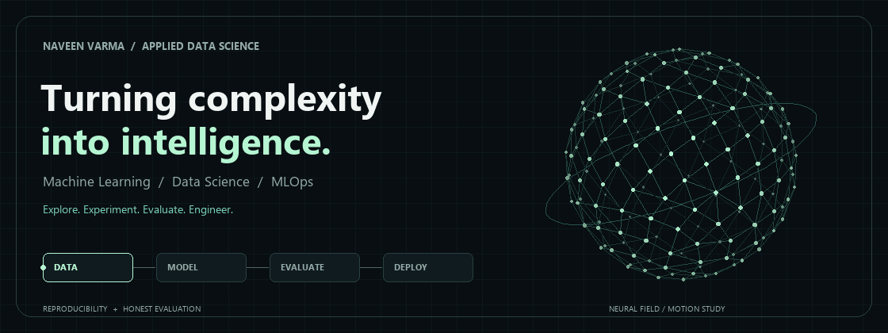
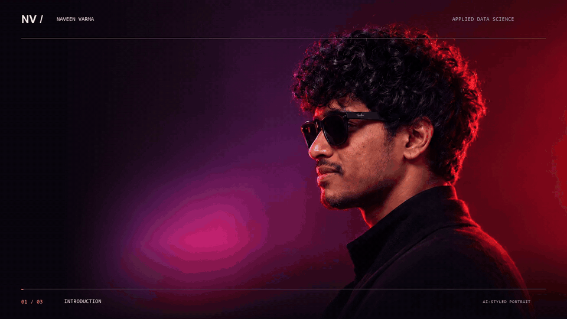
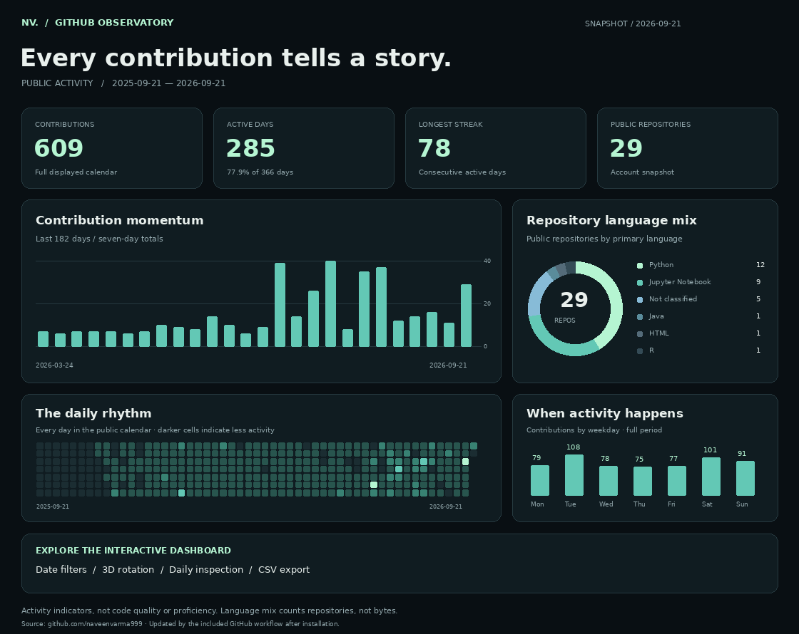
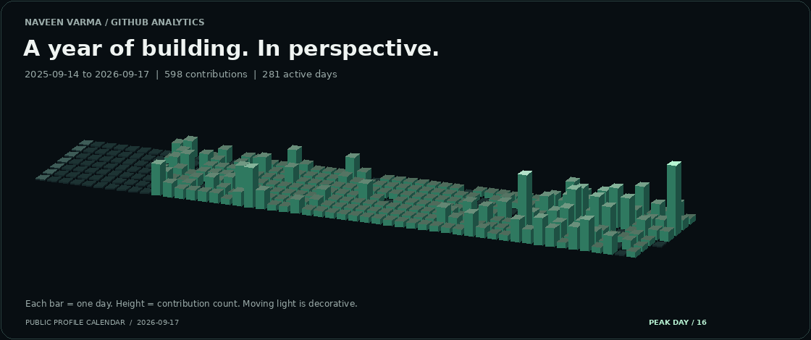

  

  <a href="./neural-banner.png">View a still version of the banner</a>

<h1 align="center">Hi, I'm Naveen Varma.</h1>

  <strong>Machine Learning Engineering · Data Science · MLOps</strong> 
  MSc Applied Data Science · University of Essex 
  Exploring the complete journey from raw data to useful ML systems.

  
  
  

  <a href="#about-me">About</a> &nbsp; / &nbsp;
  <a href="./chapter-3.png">Approach</a> &nbsp; / &nbsp;
  <a href="#toolkit">Toolkit</a> &nbsp; / &nbsp;
  <a href="#github-observatory">Analytics</a> &nbsp; / &nbsp;
  <a href="#lets-connect">Contact</a>

---

## About me

[Introduction](./chapter-1.png) · [Skills](./chapter-2.png) · [Approach](./chapter-3.png) · [LinkedIn](https://www.linkedin.com/in/naveenvarma000/)

## Toolkit

### Languages & data

  
  
  
  

### Machine learning

  
  
  

### Applications & serving

  
  
  
  

### Engineering & MLOps

  
  
  
  

### Analysis & visualization

  

  
  <strong>Matplotlib</strong> · Data visualization · Feature engineering

## GitHub Observatory

  

  <a href="https://naveenvarma999.github.io/naveenvarma999/"><strong>Explore the interactive dashboard →</strong></a> 
  Date filters · 3D rotation · Daily detail · CSV export

<!-- The interactive link becomes available after enabling GitHub Pages and running the included workflow. See START-HERE.md. -->

### Contributions in motion

  

  <a href="./analytics/contributions-3d.png">Still version</a> ·
  <a href="./analytics/activity.json">Contribution data</a>

Public GitHub activity; snapshot dates are shown on the charts. The included workflow refreshes the figures daily after installation. Repository and language totals describe the account snapshot. Contributions are activity indicators, not a measure of skill or code quality.

## Let's connect

I'm interested in **ML Engineer roles** and conversations about applied ML, model evaluation and reliable delivery.

**[LinkedIn](https://www.linkedin.com/in/naveenvarma000/) · [Email](mailto:naveennallapu750@gmail.com) · [LeetCode](https://leetcode.com/u/naveenvarma999/)**

  Curiosity drives the experiment. Evidence earns the conclusion.

