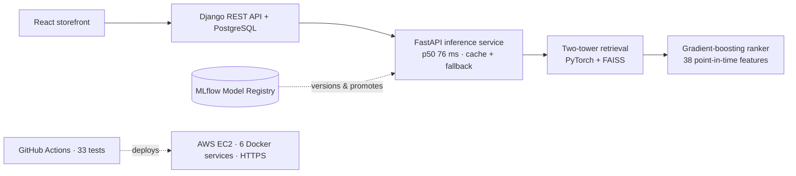
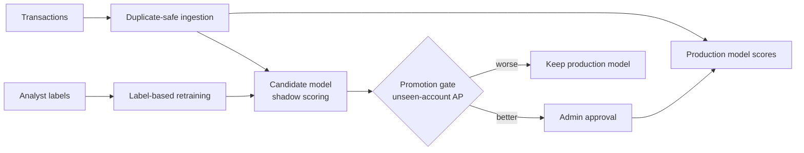

  

<h1 align="center">Hi, I'm Naveen Varma.</h1>

  

  MSc Applied Data Science · University of Essex · Colchester, UK · <b>Open to ML Engineer roles</b>

  
  
  
  

  <a href="#github-pulse">Pulse</a> &nbsp;/&nbsp;
  <a href="#featured-work">Work</a> &nbsp;/&nbsp;
  <a href="#background">Background</a> &nbsp;/&nbsp;
  <a href="#toolkit">Toolkit</a> &nbsp;/&nbsp;
  <a href="https://naveenvarma999.github.io/naveenvarma999/">Live dashboard ↗</a>

---

## GitHub pulse

<a href="https://naveenvarma999.github.io/naveenvarma999/"><b>Open the interactive GitHub Observatory →</b></a> &nbsp;·&nbsp; achievements · streak timeline · repo explorer · live commit feed · 3D view

## Featured work

<table>
  <tr>
    <td width="50%" valign="top">
      
      
<a href="https://threadline-naveen.duckdns.org"><b>Live demo</b></a> · <a href="https://github.com/naveenvarma999/threadline">Code</a>

    </td>
    <td width="50%" valign="top">
      
      
<a href="https://github.com/naveenvarma999/fraudguard"><b>Code</b></a>

    </td>
  </tr>
  <tr>
    <td colspan="2" align="center" valign="top">
      
      
MSc dissertation · University of Essex

    </td>
  </tr>
</table>

<b>How Threadline works</b> (click to expand)

```mermaid
flowchart LR
    U[React storefront] --> D[Django REST API + PostgreSQL]
    D --> F[FastAPI inference service<br/>p50 76 ms · cache + fallback]
    F --> R[Two-tower retrieval<br/>PyTorch + FAISS]
    R --> K[Gradient-boosting ranker<br/>38 point-in-time features]
    M[(MLflow Model Registry)] -. versions & promotes .-> F
    CI[GitHub Actions · 33 tests] -. deploys .-> AWS[AWS EC2 · 6 Docker services · HTTPS]
```

- **2.5× MAP@12** over a popularity baseline (0.128 vs 0.052), trained on 277K transactions
- Leakage-free, time-based validation; an ablation showed deep-learning features added under 1%
- Angular dashboard for model monitoring

<b>How FraudGuard ships models safely</b> (click to expand)

```mermaid
flowchart LR
    T[Transactions] --> I[Duplicate-safe ingestion]
    I --> S[Production model scores]
    I --> C[Candidate model<br/>shadow scoring]
    L[Analyst labels] --> RT[Label-based retraining] --> C
    C --> G{Promotion gate<br/>unseen-account AP}
    G -- better --> A[Admin approval] --> S
    G -- worse --> K[Keep production model]
```

- **0.550 AP on unseen accounts** (95% bootstrap CI 0.426–0.653) across 523K transactions and 1,197 accounts
- Brier score cut **70%** through calibration; rollback in one step
- AWS EC2 with HTTPS, MFA and rate limiting · **128 automated tests**

## About me

I build ML systems end to end: leakage-free validation, honest metrics, then tested and monitored deployment. More in [Introduction](./chapter-1.png) · [Skills](./chapter-2.png) · [Approach](./chapter-3.png).

## Background

| | Where | When |
|---|---|---|
| **Data Scientist Intern** | AI Variant · Hyderabad, India | Jun – Dec 2024 |
| **MSc Applied Data Science** | University of Essex · Colchester, UK | Sep 2025 – present |

At AI Variant I worked across the full model lifecycle: data pipelines and feature engineering in Python and SQL, model training with experiments tracked in MLflow, and a Dockerised FastAPI prediction service.

**Certifications**

| Certificate | Issuer | Year | |
|---|---|---|---|
| **SQL (Advanced)** | HackerRank | 2025 | [Verify ↗](https://www.hackerrank.com/certificates/e40a41d63714) |
| **Machine Learning A-Z** | Udemy | 2025 | [Verify ↗](https://ude.my/UC-229fbddb-ee70-42c9-87e0-dee06780397b) |
| **Deep Learning A-Z** | Udemy | 2024 | [Verify ↗](https://ude.my/UC-3bbf72ed-39f4-49fc-9897-5d8291ac87c6) |

## Toolkit

### Languages & data

  
  
  
  
  

### Machine learning

  
  
  
  
  

### Applications & serving

  
  
  
  
  

### Engineering & MLOps

  
  
  
  
  
  

### Analysis & visualization

  
  

---

  <b>Now:</b> finishing my MSc dissertation and looking for ML Engineer and MLOps roles in the UK. 
  Curiosity drives the experiment. Evidence earns the conclusion. · Panels on this page are generated daily from my public GitHub activity.

